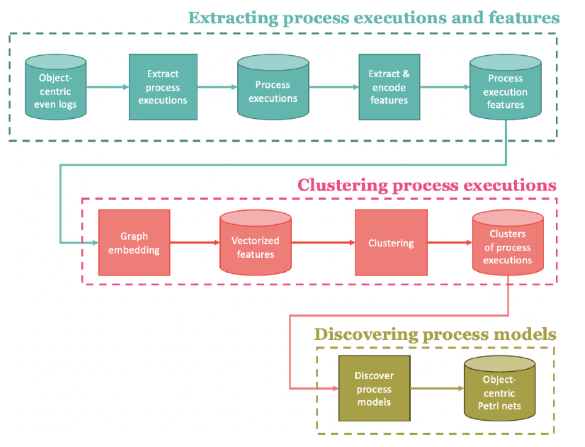

# ICCL
Improving Comprehensibility With Clustering - Process Discovery Lab WiSe 22/23.
This repository contains the source code for our project. The tool offers an implementation of the following pipeline:


# Requirements
In order to run ICCL, you need to install Docker for Windows or Docker and Docker Compose for Linux/ macOS.

# Quickstart
The code comes with a Dockerfile to build and run the application inside a docker container. To build the container run
```
docker build -t docker-iccl . 
```
After the container is built, the webapp can be run using
```
docker run -p 8050:8050 docker-iccl
```
Open ```http://127.0.0.1:8050/``` to access the running webapp.

# Usage 
We offer a detailed user manual, take a look at the user_manual.pdf.
