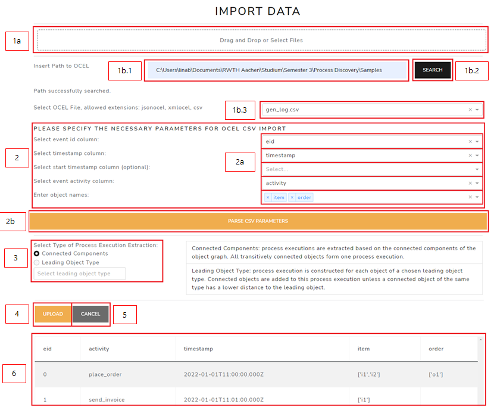
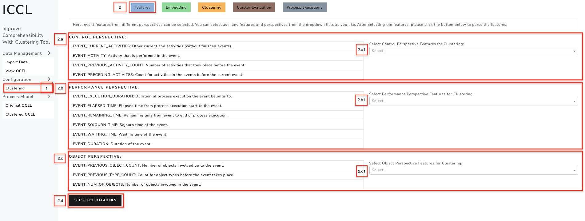
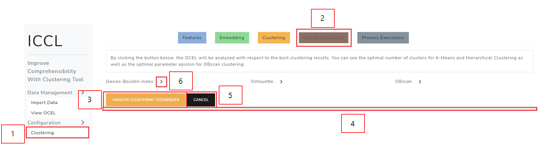
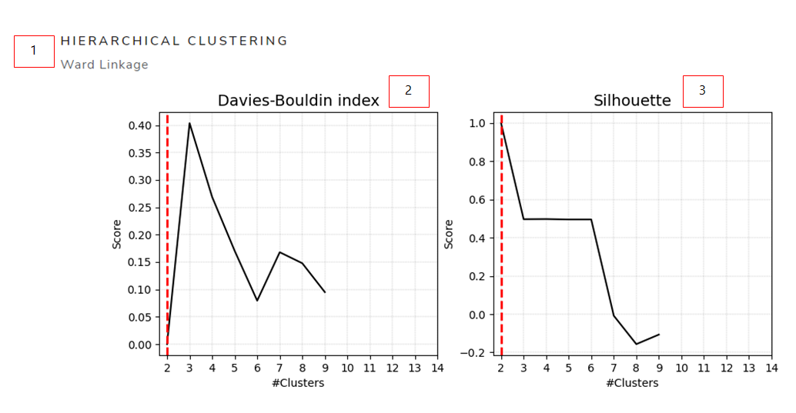
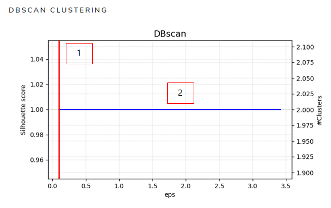
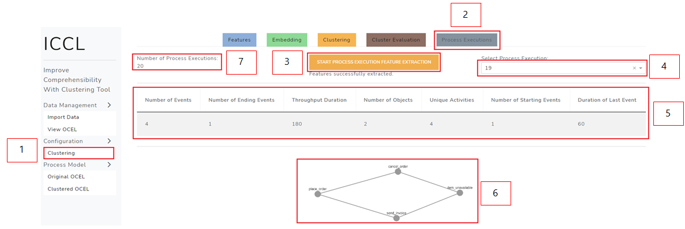
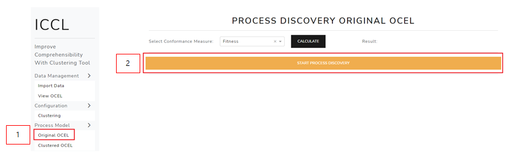
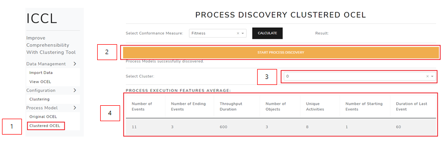
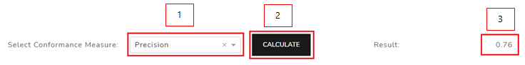
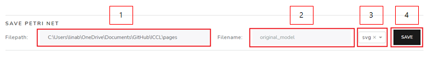

# ICCL

Welcome! This manual contains instructions how to use the ICCL tool. The aim of this project was to provide a process discovery tool that enhances the comprehensibility of discovered object-centric Petri nets by clustering.
The prerequisites to apply this tool are knowledge in Process Mining, object-centric Process Mining and unsupervised learning techniques such as clustering.
The main pipeline of the application works the following way:
1. After the installation and successfull start of the server, the user can open the application. By default, the user gets on the data import page.
2. On the import page the user can upload an object-centric event log or a csv file from their local machine. The user can load several files and can select from the directory.
3. The user then sets the configuration. This includes configuring the set of selected features, the graph embedding method, the clustering method and number of clusters as well as cluster evaluation.
4. The user applies the process discovery algorithms and receives several process models based on the clustering before. The user now have the possibility to have a more comprehensible representation of the original process model.

## Table of Content

1. [Installation](#installation) 
2. [Application Layout](#application-layout)
3. [Data Management](#data-management)
	* [Import OCEL](#import-ocel)
	* [View OCEL](#view-ocel)
4. [Configuration Pipeline](#configuration-pipeline)
	* [Feature Selection](#feature-selection)
	* [Graph Embedding](#graph-embedding)
	* [Clustering](#clustering)
	* [Automatic Clustering](#automatic-clustering)
	* [Cluster Evaluation](#cluster-evaluation)
	* [Process Executions](#process-executions)
5. [Process Discovery](#process-discovery)
	* [Discover Process Model](#discover-process-model)
		* [Comprehensive Process Model](#comprehensive-process-model)
		* [Cluster Process Models](#cluster-process-models)
	* [Conformance Checking](#conformance-checking)
	* [Export Process Model](#export-process-model)
6. [Algorithms](#algorithms)
	* [Process Execution Extraction](#process-execution-extraction)
	* [Graph Embedding Methods](#graph-embedding-methods)
	* [Clustering Techniques](#clustering-techniques)
	* [Evaluation Measures](#evaluation-measures)
		* [Cluster Evaluation](#cluster-evaluation)
		* [Model Evaluation](#model-evaluation)
	* [Model Discovery](#model-discovery)
	

## Installation
### Using Docker
The code comes with a Dockerfile to build and run the application inside a docker container. To build the container run
```
docker build -t docker-iccl . 
```
After the container is build the webapp can be run using
```
docker run -p 8050:8050 docker-iccl
```

## Application Layout


The application layout is structured the following way:
1. The sidebar, to navigate through the application pipeline. The sidebar is visible throughout the whole workflow. The user can navigate back-and-forth using these tabs.
2. The navigation bar with the linked help page which provides the manual for this tool.
3. In the middle the content of the page which can be chosen via the sidebar. By default, the user starts his ICCL journey with the data import page.
## Data Management
### Import OCEL


You have two options to import your OCEL:
* 1a: click on the drag and drop field and select a file from the file browser
* 1b.1: insert the path in which the OCEL is located
* 1b.2: click the SEARCH button
* 1b.3: select the OCEL from the list. Note: only files with .csv, .jsonocel or .xmlocel extensions are listed

If you have selected an OCEL with .csv format, the first rows of the .csv are displayed in table 6 and you have to fill out the form 2:
* 2a: specify the OCEL parameters by selecting the column names in the dropdown lists. Select the object types in the last dropdown list.
* 2b: parse the parameters by clicking the PARSE CSV PARAMETERS button

After selecting a file, proceed as follows: 
* 3: specify the type of process execution extraction. If leading object type is selected, the possible object types are loaded into the list. Select one of the object types.
* 4: click the UPLOAD button. Note: a progress bar will be displayed, showing you the progress of uploading the OCEL

Optional:
* 5: click the CANCEL button to stop the uploading process.

After successfully uploading the OCEL, the first five rows are displayed in the table 6.

Note: only OCEL files with .csv, .jsonocel or .xmlocel extensions are supported.
### View OCEL


To view the statistics and gain insight into your OCEL you can visit the 'View OCEL' page.
The page can be accessed via the sidebar clicking on 'View OCEL' (1).
Inside 2 you can see the summary statistics of your OCEL, providing information such as the object types 2.a or the activity count for each activity 2.b.
The table 3 shows the entries of the OCEL, whereas the number of rows is limited to the first 1000 rows.

## Configuration Pipeline
The configuration pipeline to cluster your process executions is as follows:

* 1: Choose the option Clustering from the sidebar
* 2: Select your features within the tab Features
* 3: Choose the graph embedding technique within the tab Embedding
* 4: Choose the clustering technique and parameters within the tab Clustering

Optional:

* 5: evaluate the clustering techniques in the Cluster Evaluation tab
* 6: visualize the process execution graphs in the Process Executions tab

### Feature Selection
The starting point of the pipeline is the feature selection. Each process execution is represented as a graph, and each node (=event) can carry different features.

We provide several possible features from different perspectives from which you can choose. Note that you don't have to choose any features at all and can choose as many features as you like.

However, you must click the SET SELECTED FEATURES button so that the chosen selection is parsed.

  

Conduct the feature selection:

1. click on the Clustering page
2. click on the Features tab
3. list of the different features with short explanations, grouped by perspective
4. select the desired features in the dropdown lists - note: you don't have to select features for each perspective
5. click the SET SELECTED FEATURES button
### Graph Embedding
The process execution graphs get enriched with features and are then embedded, so that a clustering algorithm can handle them. In the graph embedding tab, you can specify which kind of embedding technique you want to use. Please see [Graph Embedding Methods](#graph-embedding-methods) for more information about the embedding algorithms.


To specify the graph embedding technique, follow those steps:

1. click on the Clustering page
2. click on the Embedding tab
3. select one of the embedding techniques
4. depending on your selection in 3., a set of adjustable parameters is displayed - you can insert custom parameter values or leave it at the default settings
5. click the PARSE EMBEDDING PARAMETERS button
#### Custom Feature Graph Embedding
#### Graph2Vec
#### Feather-G
### Clustering


### Automatic Clustering

### Cluster Evaluation
If you want to cluster the process executions using K-Means or Hierarchical Clustering, you might not know which number of clusters is suitable. On the other hand, if you apply DBscan, where you don't have to specify the number of clusters, you must specify the epsilon parameter. To give you more insight into the effect of changing those parameters, you can try the cluster evaluation analysis that is included in ICCL. 

Note: before launching the cluster evaluation, you have to parse the features and graph embedding parameters.



Execute the cluster evaluation:
1. click on the Clustering page
2. click on the Cluster Evaluation tab
3. click the ANALYZE CLUSTERING TECHNIQUES button
4. look at the progress bar to see how far the process progressed
5. optional: click the CANCEL button to stop the cluster evaluation

To get more information about the scores that are calculated, you can click on the arrows next to the name (6.)
After the cluster evaluation was successfully executed, you can see different plots:

* Hierarchical Clustering: silhouette score, Davies-Bouldin index score for average and ward linkage
* K-Means: silhouette score and Davies-Bouldin index score
* DBscan: silhouette score for different epsilon

Look at the following plots  by way of example:

1. shows the type of clustering algorithm that was used
2. result for Davies-Bouldin index for different #clusters
3. result for silhuette score for different #clusters

The red dashed line indicates the best number of cluster, i.e. the number of clusters that eventuated in the optimal score.

The resulting plot for DBscan evaluation looks a bit different:

1. indicates the optimal value for epsilon
2. shows the resulting number of clusters 

### Process Executions
One of the key aspects in ICCL is the process execution. If you want to gain more insights into the process executions of your OCEL, you can do so on the Process Executions  page.

Note: you can visualize the process executions and inspect its features at any point after uploading the OCEL.

To visualize the graph of one process execution and see its features, perform the following steps:


1. click on the Clustering page
2. click on the Process Executions tab
3. click on the START PROCESS EXECUTION FEATURE EXTRACTION button
4. select a process execution in the dropdown list

The results are the following:

5. feature table with the features that were extracted from the process execution
6. graph of the process execution: 
* to move the position of a node,  click on the node and pull it to the desired location
* to move the whole graph, click on an edge and pull it to the desired location
* to zoom in and out, locate the cursor on the graph and use the scroll wheel of your mouse

At any point after uploading the OCEL, you can see the number of process executions in 7.
## Process Discovery

### Discover Process Model
You can discover the Process Model for the original OCEL as well as for the sub-logs that are created by clustering the OCEL. Before discovering the latter Process Models, you have to go through the ICCL pipeline, so that clusters are already created. You can discover the comprehensive Process Model at any point after uploading the OCEL.
#### Comprehensive Process Model


Conducting the process discovery:
1. click on the 'Original OCEL' page
2. click the 'START PROCESS DISCOVERY' button

After the process discovery is performed, the resulting model is displayed below. 
You can manipulate the view of the process model:
* to move the view of the model,  click on the model and pull it to the desired location
* to zoom in and out, locate the cursor on the model and use the scroll wheel of your mouse

#### Cluster Process Models


Conducting the process discovery:
1. click on the 'Clustered OCEL' page
2. click the 'START PROCESS DISCOVERY' button
3. select the process model of a specific cluster by selecting the cluster's number in the dropdown list
4. the table displays the average feature values of the process executions that belong to the model

You can manipulate the view of the process model:
* to move the view of the model,  click on the model and pull it to the desired location
* to zoom in and out, locate the cursor on the model and use the scroll wheel of your mouse

### Conformance Checking
To compare the process model with the OCEL, you can apply two conformance checking methods: fitness and precision. Before checking the conformance of the clustered Process Models, you have to go through the ICCL pipeline, so that clusters are already created. You can check the conformance of the comprehensive Process Model at any point after uploading the OCEL.

1. select a measure: fitness or precision
2. click the CALCULATE button
3. result of the measure (in case of conformance checking on the clustered OCEL, a table is displayed, showing the result for each cluster)

### Export Process Model
After discovering a process model for the original OCEL or for the clustered sub-logs (and a cluster is selected), this segment shows up:


To save the displayed process model, follow these steps:
1. insert the path to the location at which the image should be saved
2. enter a name for the image
3. select the file extension: png or svg
4. click the SAVE button

## Algorithms

Here you can find a short description of the algorithms that are used in ICCL.

### Process Execution Extraction

A process execution is a set of events of connected objects and resembles the case notion in traditional Process Mining. You can choose between two different types of extraction methods:

*  **Connected Components**: the technique uses the object graphs and extracts a process execution based on all transitively connected objects. This way, complex event logs might lead to large process executions.

*  **Leading Object Type**: after choosing one object type as the leading type, a process execution is constructed by looking at each object of the object type. Objects that are connected to the leading object are added to the process execution unless another object of that type has a lower distance. As a result, the process executions are more limited in size.

### Graph Embedding Methods

*  **Custom Feature Graph Embedding**: especially designed for ICCL. The algorithm first creates a node embedding via FeatherNode which uses characteristic functions of node features with random walk weights to describe node neighborhoods. In the second step, the node embeddings are averaged over each dimension, resulting in a vectorized embedding of the graph. Focusses **features**, the structure of the process execution graphs is only implicitly considered. Check out the [karateclub documentation](https://karateclub.readthedocs.io/en/latest/_modules/karateclub/node_embedding/attributed/feathernode.html) for more information about the FeatherNode parameters that can be configured. 

*  **Graph2Vec**: first identifies subgraphs sourrounding each node in the feature graphs. By means of the Weisfeiler-Lehman’s algorithm, the subgraphs are considered as the vocabulary for a doc2vec SkipGram model. Since the graph’s structure is captured within the algorithm, feature graphs that are similar in structure will be close in the embedding space. Focusses the **graph structure** and additionally allows one feature per node. Check out the [karateclub documentation](https://karateclub.readthedocs.io/en/latest/_modules/karateclub/graph_embedding/graph2vec.html) for more information about the parameters that can be configured. 

*  **Feather-G**: uses characteristic functions defined on graph vertices to describe the distribution of vertex attributes. Feather-G extracts node-level features that are pooled and then used to create a description of the feature graph. Focusses only the **graph structure**. Check out the [karateclub documentation](https://karateclub.readthedocs.io/en/latest/_modules/karateclub/graph_embedding/feathergraph.html) for more information about the parameters that can be configured. 

### Clustering Techniques
ICCL makes use of the sklearn.cluster module to apply different clustering algorithms to the embedding. Please refer to the [sklearn.cluster documentation](https://scikit-learn.org/stable/modules/classes.html#module-sklearn.cluster) to gather more information about the clustering parameters that can be configured in ICCL. 
*  **K-Means**: clusters data by trying to separate samples in k groups of equal variance. It aims to choose centroids that minimize the within-cluster sum-of-squares. The number of clusters (k) has to be specified beforehand.

*  **Hierarchical Clustering**: builds nested clusters by merging or splitting them successively. This hierarchy of clusters is represented as a tree, whereas the root is the unique cluster gathering all samples and the leaves are clusters containing only one sample. In ICCL, you have to specify the number of clusters beforehand.

*  **Mean-Shift**: aims to discover blobs in a smooth density of samples. It is a centroid based algorithm, which works by updating candidates for centroids to be the mean of the points within a given region.

*  **Affinity-Propagation**: Affinity-Propagation creates clusters by sending messages between pairs of samples until convergence. The algorithm finds members of the data points that are representatives of the clusters.

*  **DBscan**: Density-Based Spatial Clustering of Applications with Noise is an clustering approach that finds core samples of high density and expands clusters from them. The parameter epsilon is specifying the radius of a neighborhood with respect to some point, in which the number of neighboring points is counted.

### Evaluation Measures

#### Cluster Evaluation

*  **Silhouette Score**: quantifies the space between different clusters. For each number of clusters, a clustering algorithm is performed. Afterwards, it is measured how similar the observation are to the assigned cluster and how dissimilar they are to the observation of the nearest cluster. The measure has the range [-1,+1], whereas a score near +1 indicates that the clusters are well separated and negative scores indicate that the samples might be wrongly separated. Generally, the silhouette score is calculated for each datapoint and then averaged over the whole dataspace. You can find the calculation steps here: [click](https://en.wikipedia.org/wiki/Silhouette_(clustering))

*  **Davies-Bouldin Index**: measure of the ratio between within-cluster distances, and between cluster distances. The score is bounded between [0, 1]. The lower the value, the tighter the clusters and the seperation between clusters. The steps of calculation can be found here: [click](https://en.wikipedia.org/wiki/Davies%E2%80%93Bouldin_index)

#### Model Evaluation

*  **Fitness**: measures to what extend the observed traces can be replayed by the model.

*  **Precision**: measures the extend of behaviour that is not captured in the event log, but allowed in the model.

### Model Discovery

The discovery of an object-centric Petri net works as follows: for each object type, a flattened event log is created and subsequently an accepting Petri net is discovered. For the discovery part, ICCL supports the Inductive Miner. In the second step, the Petri nets are merged into one Petri net. The object types are assigned to places and the variable arcs are identified.

**Inductive Miner**: the algorithm recursively performs the following steps
* build a directly follows graph from the log
* find a cut and return the cut-operator and cut-partition
* split the log into sublogs
